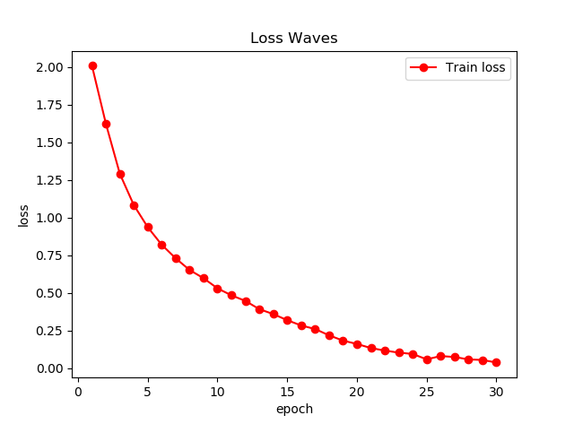
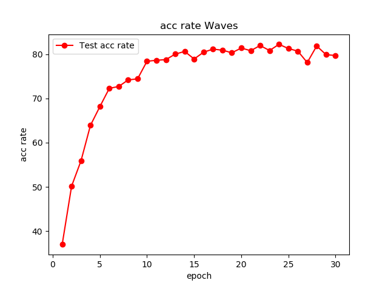
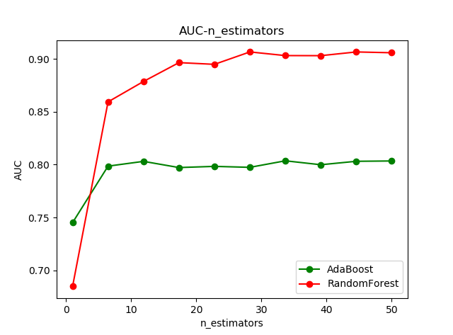

# code-of-ml2018-course 

### 对数几率回归(LR)
- 使用MATLAB编写
- 使用UCI数据集[Page Blocks](./LR/assign2_dataset)
- 直接运行LR_main.m

### all-convolutional-cnn
- 参考[论文链接](https://arxiv.org/pdf/1412.6806.pdf)
- 使用[CIFAR10](https://en.wikipedia.org/wiki/CIFAR-10)数据集
- 直接运行complex_cnn.py

### Ensemble-Learning
- 基于sklearn中决策树实现AdaBoost和RandomForest
- 使用UCI数据集[Adult](./EnsembleLearning/adult_dataset)
- 直接运行BoostMain.py或者RandomForestMain.py

